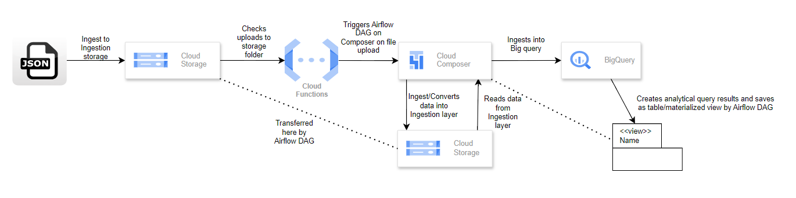

# Data Engineering on GCP Platform
## Motivation
Purpose of this repository is to create an ETL activity on GCP by harnessing Cloud Funtions (Triggering DAGS), Airflow (Cloud Composer) and BigQuery.
Source data is football Application data in JSON format.

Below is the flow diagram of established structure

## Flow Diagram
   

